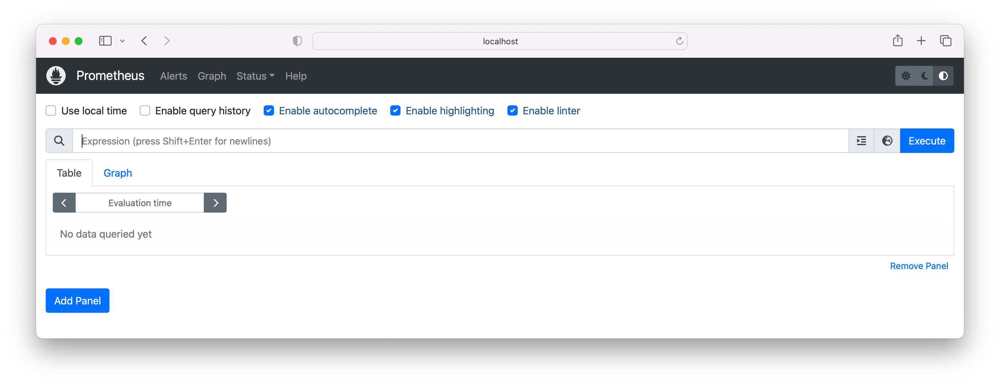

Add the Helm chart repository using the provided the URL. The name assigned to the URL is `prometheus-community`.

```
$ helm repo add prometheus-community https://prometheus-community.github.io/helm-charts
"prometheus-community" has been added to your repositories
```

Update the chart information with the following command.

```
$ helm repo update prometheus-community
Hang tight while we grab the latest from your chart repositories...
...Successfully got an update from the "prometheus-community" chart repository
Update Complete. ⎈Happy Helming!⎈
```

You can search published chart versions in the the repository named `prometheus-community`.

```
$ helm search hub prometheus-community
URL                                               	CHART VERSION	APP VERSION	DESCRIPTION
https://artifacthub.io/packages/helm/prometheus...	45.28.1      	v0.65.1    	kube-prometheus-stack collects Kubernetes manif...
...
```

Install the latest version of the chart `kube-prometheus-stack`.

```
$ helm install prometheus prometheus-community/kube-prometheus-stack
NAME: prometheus
LAST DEPLOYED: Thu May 18 11:32:31 2023
NAMESPACE: default
STATUS: deployed
REVISION: 1
NOTES:
kube-prometheus-stack has been installed. Check its status by running:
  kubectl --namespace default get pods -l "release=prometheus"

Visit https://github.com/prometheus-operator/kube-prometheus for instructions on how to create & configure Alertmanager and Prometheus instances using the Operator.
```

The installed charts can be listed with the following command.

```
$ helm list
NAME      	NAMESPACE	REVISION	UPDATED                             	STATUS  	CHART                        	APP VERSION
prometheus	default  	1       	2023-05-18 11:32:31.958955 -0600 MDT	deployed	kube-prometheus-stack-45.28.1	v0.65.1
```

One of the objects created by the chart is the Service named `prometheus-operated`. This Service exposes the Prometheus dashboard on port 9090.

```
$ kubectl get service prometheus-operated
NAME                  TYPE        CLUSTER-IP   EXTERNAL-IP   PORT(S)    AGE
prometheus-operated   ClusterIP   None         <none>        9090/TCP   114s
```

Set up port forwarding from port 8080 to port 9090.

```
$ kubectl port-forward service/prometheus-operated 8080:9090
Forwarding from 127.0.0.1:8080 -> 9090
Forwarding from [::1]:8080 -> 9090
```

Open a browser and enter the URL http://localhost:8080/. You will be presented with the Prometheus dashboard.



Uninstall the chart with the following command.

```
$ helm uninstall prometheus
release "prometheus" uninstalled
```